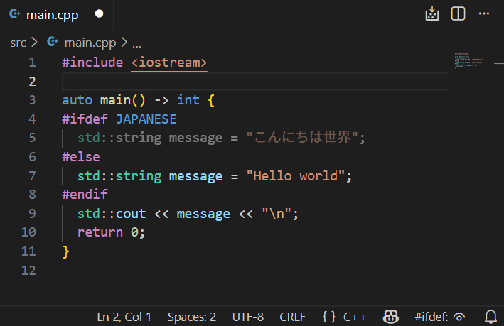

# Hide #ifdef Regions

A Visual Studio Code extension that hides inactive code regions including `#ifdef`, `#else`, and preprocessor directives in C/C++ files, making code easier to read even in files with many conditional compilation blocks.

> **Note**: This extension supports only the [clangd extension](https://marketplace.visualstudio.com/items?itemName=llvm-vs-code-extensions.vscode-clangd). It does **not** support the Microsoft C/C++ extension (`ms-vscode.cpptools`).

## Features

- **Hide Inactive Code Regions**: Automatically hides code regions that are disabled by preprocessor directives based on your current build configuration
- **Customizable Opacity**: Control how hidden regions appear (from completely invisible to fully visible)
- **Status Bar Control**: Convenient status bar button to quickly toggle visibility
- **Persistent Toggle State**: Your toggle preference is automatically saved and restored for each workspace

This extension is particularly useful when working with codebases that heavily use conditional compilation with `#ifdef`, `#ifndef`, `#if`, `#else`, `#elif`, and `#endif` directives.

## Requirements

This extension requires the [clangd extension](https://marketplace.visualstudio.com/items?itemName=llvm-vs-code-extensions.vscode-clangd) to be installed.

## Commands

- **Toggle #ifdef Region Visibility**: Show or hide inactive code regions

## Settings

This extension provides the following settings:

- `ifdef.enabled`: Enable hiding of inactive code regions on startup (default: `false`)
- `ifdef.opacity`: Opacity level for hidden regions, where 0 = invisible and 1 = fully visible (default: `0`, range: `0` to `1`)

## Usage

1. Open a C/C++ file in VS Code
2. Ensure clangd is configured for your project
3. Toggle visibility using either method:
   - Click the status bar button labeled "#ifdef" in the bottom right
   - Use the command palette (`Ctrl+Shift+P` or `Cmd+Shift+P`) and run "Toggle #ifdef Region Visibility"
4. Inactive code regions will be hidden or shown based on your toggle state

**Note**: Your visibility preference (show/hide) is automatically saved per workspace and will be restored when you reopen the workspace.

## License

MIT
